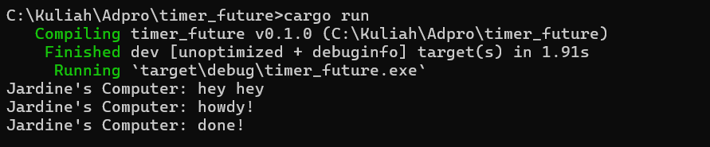
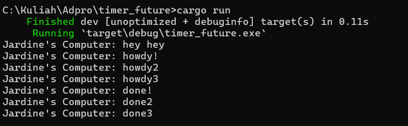
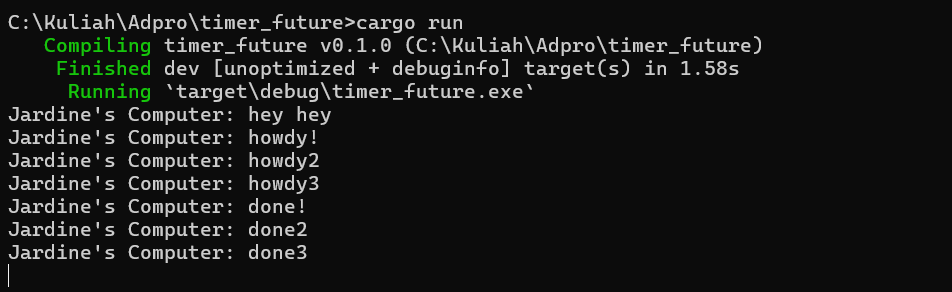

### **Understanding how it works.**
  
> Screenshot shows that the added sentence after spawner.spawn(); got printed first before the two print commands in spawner.spawn();. As I understand it, asynchronous code in Rust allows for operations to run concurrently without blocking the execution of the entire program. The results indicates that the program managed to execute the the outside print command first before the spawner did it's job, due to it not needing to wait for the spawner to finish.
  

### **Multiple spawners and removing drop, an explanation.**
  
> Screenshot shows the console for multiple spawners. Same goes as before, the program does not wait for the spawner tasks to finish. "hey hey" gets printed first, and then the three "howdy"s is printed, as the spawner tasks are running asynchronously. Two seconds later, the three "done"s are shown. With drop(spawner);, the program stops.
  

  
> Without drop(spawner), the program doesn't end after executing all the commnands. The Executor is still waiting for more tasks to be added. Drop function signifies that all of the tasks have been assigned.
